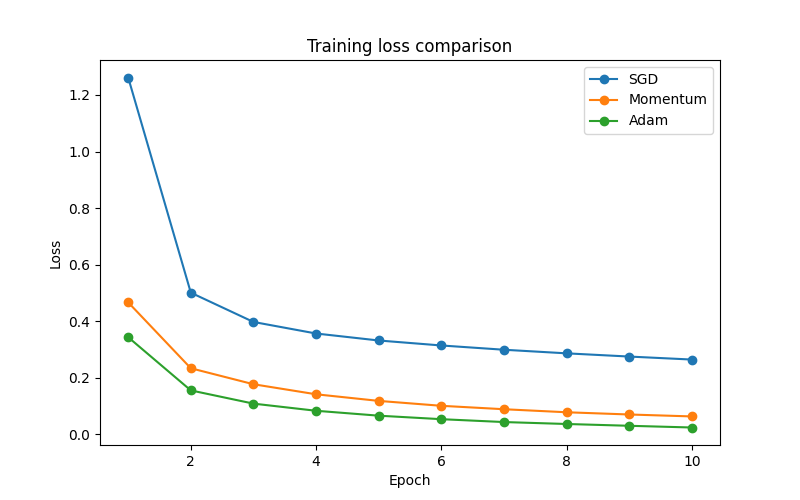
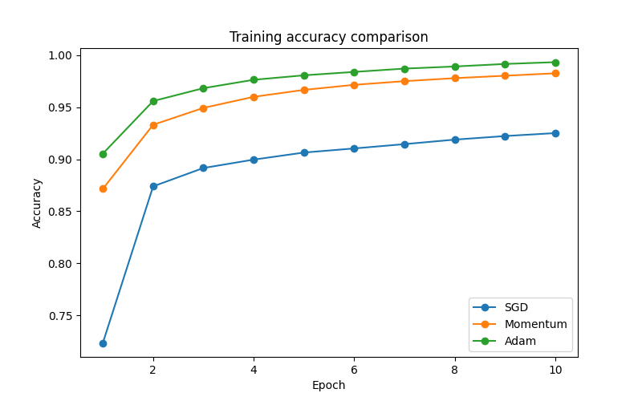
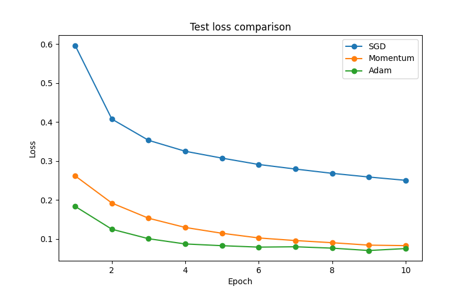
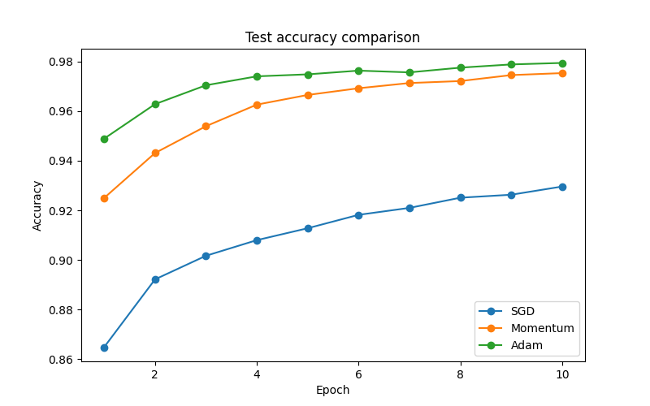

# MNIST 0-9 Classifier
A simple classification of hand drawn digits from 0 to 9 classifier, implemented using Multi Layered Perceptron(MLP).
It has an architecture of 784 -> 128 -> 10.
The accracy of this network is 97.8%

# Prerequisites

```bash
    python3.12 -m venv nn
    source nn/bin/activate
    pip install -r requirements.txt
```

# Configuration
It has 3 different gradient descent algorithms, Stochastic Gradient Descent (SGD), Momentum Based Gradient Descent (momentum) and, Adam.

In the `train.py` all the three algortihms are written and the active one is being used, to use a different one just uncomment it, and vice-versa, to use different optimizers to see the result.

# Project structure
```text    
├── gui
│   ├── app.py
│   ├── canvas_utils.py
│   ├── inference.py
│   ├── __init__.py
│   ├── preprocess.py
├── models
│   ├── __init__.py
│   ├── mlp.py
│   └── read.py
├── README.md
├── requirements.txt
├── train.py
└── utils
    ├── dataset.py
    ├── metrics.py
    ├── optimizer.py
    ├── plot.py
    └── train_utils.py
```

# Usage
In order to see the graphical analysis of each algorithms performance just change the commented code to normal and run `train.py`, it will give you the desired comparison.  
In order to see how well does the model classifies a drawn digit simply run the command:

```bash
    python -m gui.app
```
By default it will use ADAM, so if you want to change the model used for hand writing you need to change the filename to be used in `gui/inference.py`.

# Performance of Different Optimizers:
<p>
  
  
</p>

<p>
  
  
</p>

# Future Updates
As this currently uses MLP, later it will be switched over to CNN, for better accuracy and understanding how CNNs are better in vision based systems.

# Author
Phenesin (https://github.com/Phenesin)